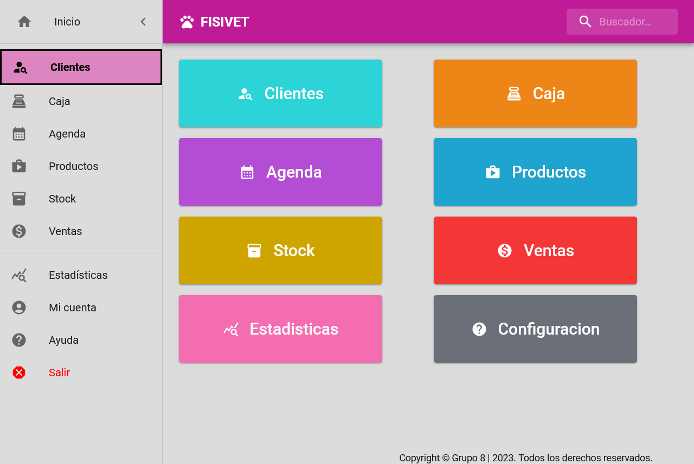

# Proyecto FISIVET - Maquetación

<!-- TOC -->
* [Proyecto FISIVET - Maquetación](#proyecto-fisivet---maquetación)
  * [Tecnologías Utilizadas](#tecnologías-utilizadas)
  * [Instrucciones de Instalación](#instrucciones-de-instalación)
    * [Requisitos](#requisitos)
    * [Pasos](#pasos)
    * [Cómo ejecutar la Aplicación](#cómo-ejecutar-la-aplicación)
    * [Comandos Disponibles](#comandos-disponibles)
  * [Contribuir](#contribuir)
  * [Licencia](#licencia)
<!-- TOC -->

Este proyecto es un sofisticado sistema de tablero de control para una clínica veterinaria. Proporciona una visualización rápida y fácil de los datos clave del negocio, incluyendo citas, facturas y registros de pacientes. La utilización de una gama de modernas herramientas de programación y bibliotecas de JavaScript asegura un rendimiento óptimo y una interfaz de usuario intuitiva. Este tablero se posiciona como una herramienta fundamental para ayudar a los profesionales del cuidado de animales a tomar decisiones informadas que agilizan su práctica.

Ver Demo: https://josueestrada.github.io/vet-mui-app/

## Tecnologías Utilizadas

- emotion/react
- emotion/styled
- fontsource/roboto
- fullcalendar/core
- fullcalendar/daygrid
- fullcalendar/interaction
- fullcalendar/react
- fullcalendar/resource-timegrid
- fullcalendar/timegrid
- mui/icons-material
- mui/material
- mui/x-data-grid
- nivo/bar
- nivo/calendar
- nivo/core
- nivo/line
- nivo/marimekko
- nivo/pie
- nivo/waffle
- formik
- react
- react-dom
- react-router-dom
- recharts
- yup

## Instrucciones de Instalación

### Requisitos

- NodeJS@18.15.0
- NPM@9.5.0

### Pasos

1. Clonar el repositorio a tu local
````shell
git clone https://github.com/JosueEstrada/vet-mui-app.git
```` 
2. Dirigirse a la carpeta del proyecto

````shell
cd vet-mui-app
````

3. Instalar las dependencias

````shell
npm install
```` 

### Cómo ejecutar la Aplicación

Luego de la instalación, puedes ejecutar la aplicación con el comando:
````shell
npm run dev
```` 

Y acceder a través de la url http://localhost:5173/ en tu navegador.
### Comandos Disponibles
* `npm run dev`: Ejecuta el servidor de desarrollo de Vite.
* `npm run build`: Genera una versión de producción del proyecto.
* `npm run lint`: Ejecuta ESLint para detectar problemas en el código.
* `npm run preview`: Ejecuta la versión de producción en un servidor local para su revisión.
## Contribuir
Si deseas contribuir al proyecto, por favor realiza un fork del repositorio, realiza tus cambios y envía un pull
request.
## Licencia
Este proyecto está bajo la licencia MIT.